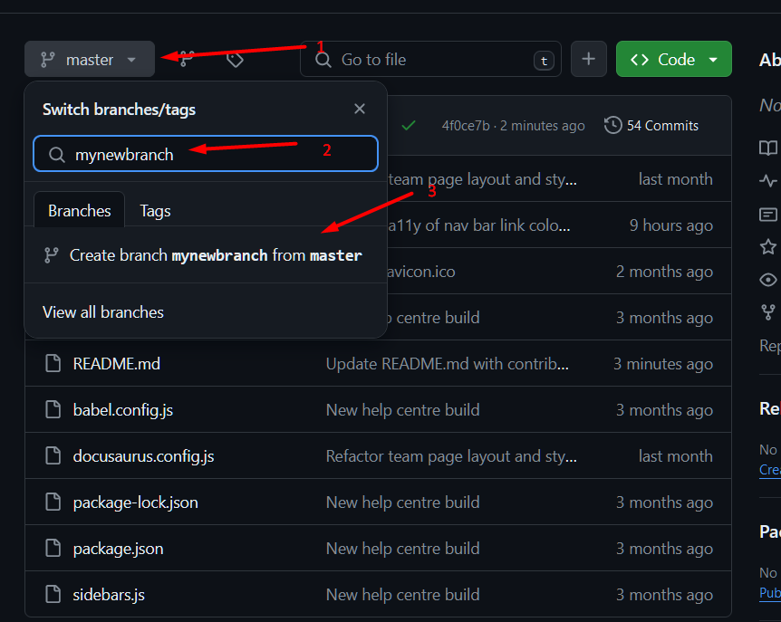
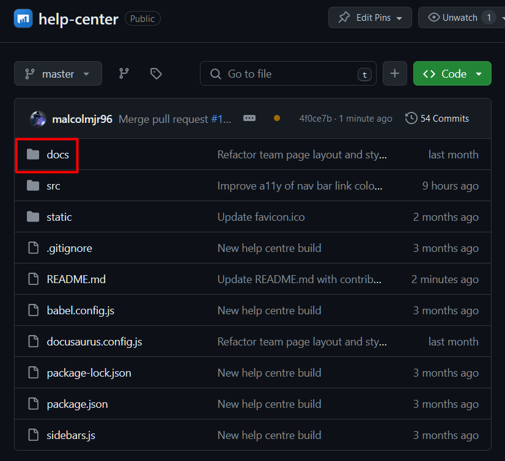
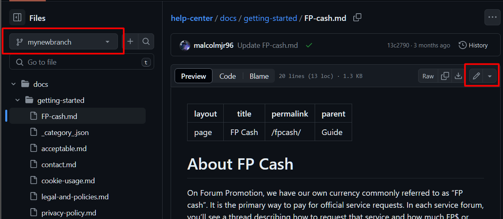
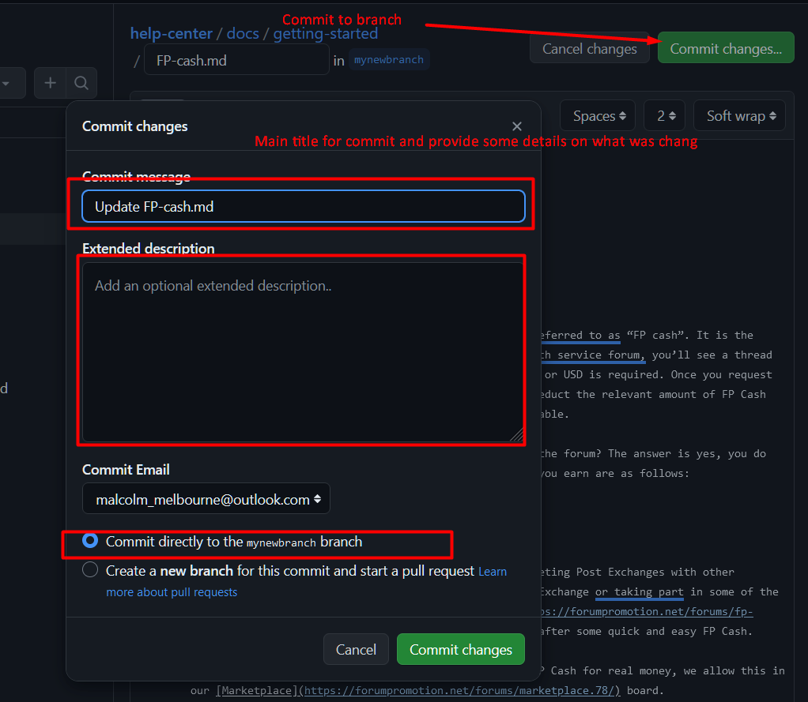
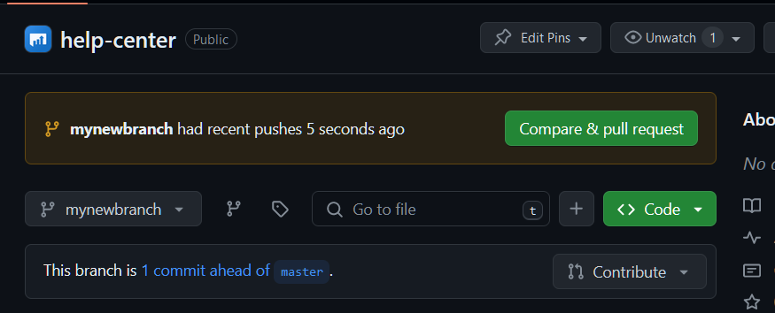
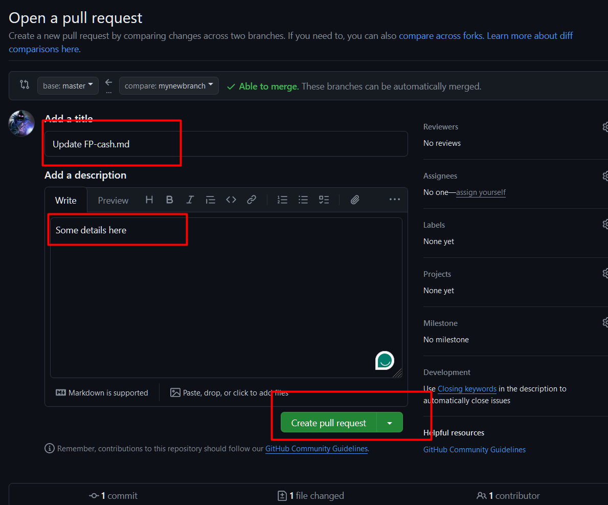

# Contributing

If you intend to edit the content of the help center, then all you need to do is create a new branch. Once created make sure you are using that new branch. From there create or edit the docs within the `/docs` folder.





Once your edits are complete, go to the root of the repo and merge pull request. Someone will review it, provide any feedback/changes if required then merge your branch into main.






# Website

This website is built using [Docusaurus](https://docusaurus.io/), a modern static website generator.

### Installation

```
$ yarn
```

### Local Development

```
$ yarn start
```

This command starts a local development server and opens up a browser window. Most changes are reflected live without having to restart the server.

### Build

```
$ yarn build
```

This command generates static content into the `build` directory and can be served using any static contents hosting service.

### Deployment

Using SSH:

```
$ USE_SSH=true yarn deploy
```

Not using SSH:

```
$ GIT_USER=<Your GitHub username> yarn deploy
```

If you are using GitHub pages for hosting, this command is a convenient way to build the website and push to the `gh-pages` branch.
